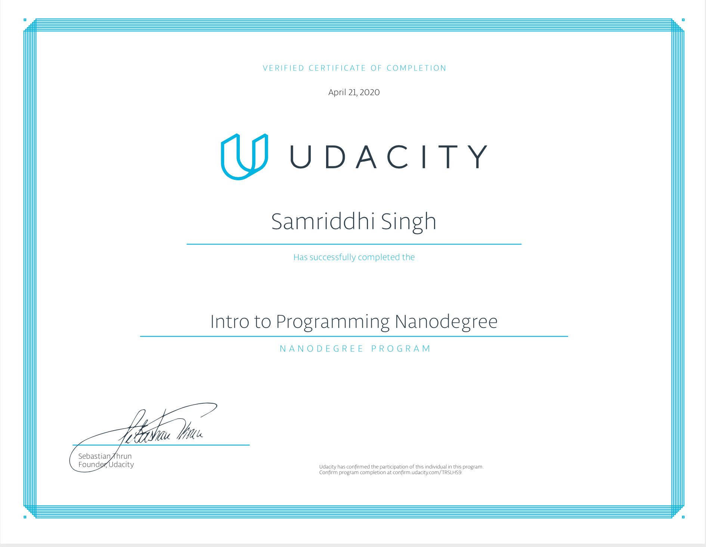

# intro_to_programming_nd 
all projects from the udacity intro to programming nanodegree 
These are all my project/case studies(that I liked or enjoyed) 
every project or case study has its readme's explaining the projects. 
this nanodegree covers the programming languages or markup langueges: 
<ul>
<li>html
<li>css
<li>python
<li>javascript
</ul>
<h1>Projects</h1>
<h2><a href="https://github.com/simsalabim1/intro-to-programming-nd/tree/master/project1-octopus-trading-card"> animal trading card </a></h2>
in this project you made both a html and css page displaying a animal trading card wich is a web-based trading card wich shows your favourite animal.I chose the octopus🐙
here is my certificate: 

