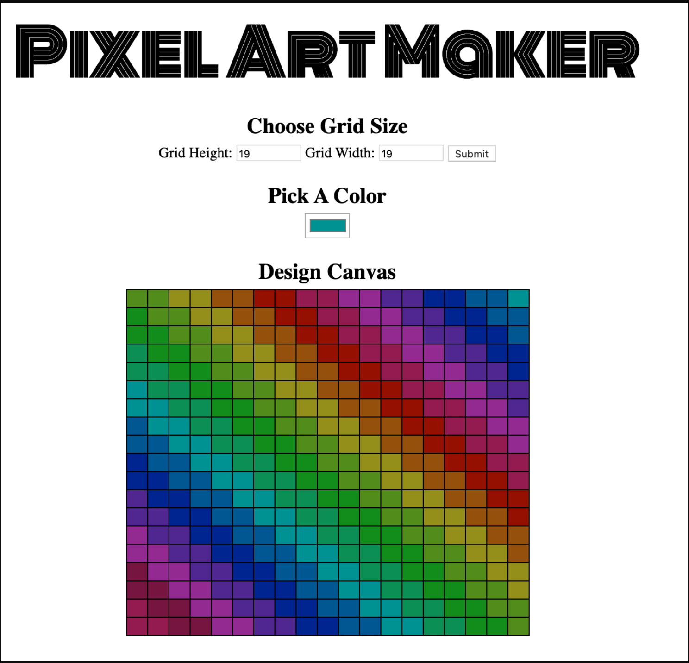

This is a pixel art maker where you can chose your grid and draw into and fill it with any color you like.  
 
you will find Java-script code that is connected to the index.html file. 
To access, the program download the code and then drag the index.html file onto the browser or simply press this link [here](https://simsalabim1.github.io/project-pixel-art-maker-starter-master/)
HAVE LOTS OF FUN!!!

